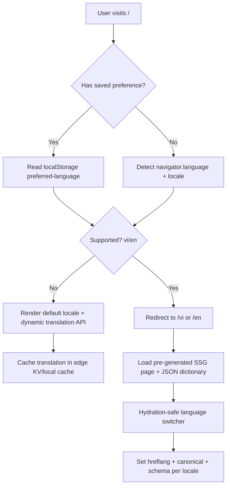

# Multilingual translation architecture

## Mode 1 (SEO-safe)
- `vi` and `en` pages are statically generated.
- Full metadata/hreflang/canonical are language-specific.

## Mode 2 (AI dynamic)
- For unsupported languages (`/fr`, `/ja`, etc.) you can add middleware fallback to runtime translation API.
- Caching layer stores translated segments to reduce cost and latency.
